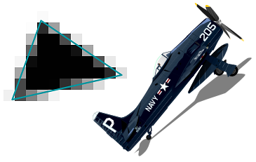

# nimAGG
nimAGG is a Nim port of Anti Grain Geometry(AGG)

High Fidelity 2D Graphics. A High Quality Rendering Engine for Nim

---

[![Build Status][badge-nimagg-travisci]][nimagg-travisci]
[![Build status][badge-nimagg-appveyor]][nimagg-appveyor]



This project relying on recent bugfixes of Nim compiler, so you should use devel
branch on Github, or at least Nim ver 0.18.1 to compile this project.

Those bugfixes are:
  - proc parameter shadowing inside template
  - mixin inside generic proc generated by template
  - inheriting generic object
  - inheriting partial specialization generic object
  - type alias via template
  - call proc of partial/specialized/some generic object by subtype object
  - generic proc forward declaration
  - generic object with generic field(s) type obtained via template(WIP)


## How to build demos?

build all demos:

```bash
cd examples
nim e build.nims
```

or if you want to build single demo:

```bash
cd example
nim c ex_aa_demo
```

## How to build command line only demos without GUI?

build all demos:

```bash
cd examples
nim e -d:platform_null build.nims
```

build single demo:

```bash
cd example
nim c -d:platform_null ex_compositing
```

the above command will produce executables without gui, and you can call it with:

```bash
ex_compositing -v
or
./ex_compositing -v
```

it will produce screenshot with image format BMP

if you want to use SDL instead of native API, compile like this:

```bash
nim c -d:platform_sdl ex_lion
```

## Dependencies
  * These are nimble packages needed to build nimAGG
    * [nimBMP](https://github.com/jangko/nimBMP)
    * [polyBool](https://github.com/jangko/polyBool)(optional)
    * [freetype](https://github.com/jangko/freetype)(optional)
    * [sdl2_nim](https://github.com/Vladar4/sdl2_nim)(optional)
    * [x11](https://github.com/nim-lang/x11)(if your platform is Linux with GUI)
    * [opengl](https://github.com/nim-lang/opengl)(Mac OS with GUI)
    * [objc](https://github.com/jangko/objc)(Mac OS with GUI)
  * And here are wrapped library locations:
    * [libfreetype](https://www.freetype.org)(optional)
    * [libsdl](https://www.libsdl.org)(optional)

## Installation
You can install this package via nimble
```text
nimble install nimAGG
```

[nimagg-travisci]: https://travis-ci.org/jangko/nimAGG
[nimagg-appveyor]: https://ci.appveyor.com/project/jangko/nimagg
[badge-nimagg-travisci]: https://travis-ci.org/jangko/nimAGG.svg?branch=master
[badge-nimagg-appveyor]: https://ci.appveyor.com/api/projects/status/github/jangko/nimAGG?svg=true
